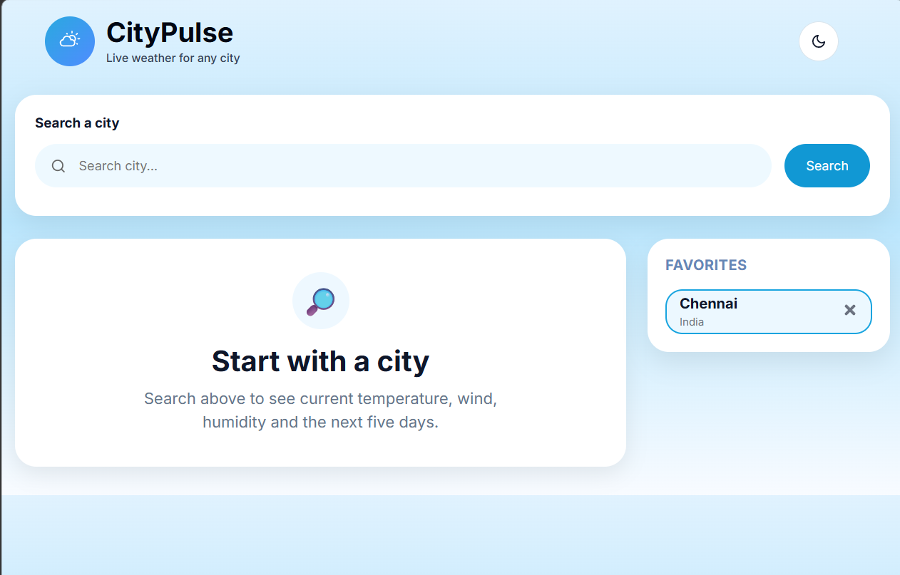
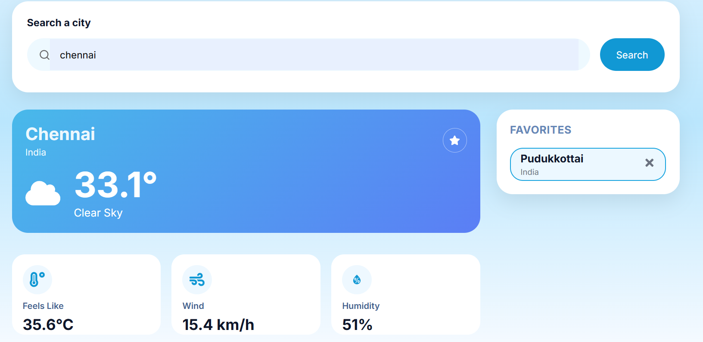
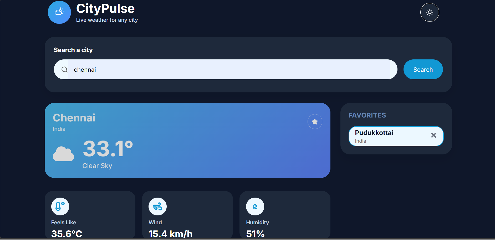
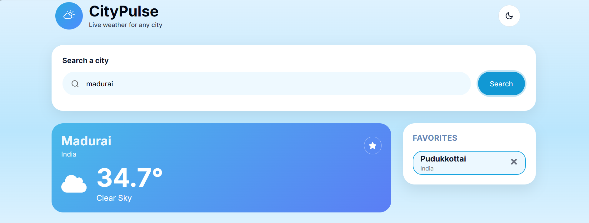

# 🌤️ CityPulse - Responsive Weather Dashboard

## 📖 Project Overview

CityPulse is a responsive weather dashboard developed using **React**, **JavaScript (ES6+)**, and **CSS3**. The application enables users to search for any city and view its current weather conditions using the Open-Meteo APIs. It provides a clean, responsive, and user-friendly interface with features such as favorite cities, dark/light mode, and loading states.

---

## ✨ Features

- 🔍 Search weather by city name
- 📍 Convert city name into latitude and longitude using the Open-Meteo Geocoding API
- 🌡️ Display current temperature
- 💧 Display humidity
- 💨 Display wind speed
- 🌤️ Display weather condition
- ⭐ Save favorite cities
- 🗑️ Remove favorite cities
- 💾 Store favorite cities using browser localStorage
- 🌙 Dark / Light theme with persistence
- ⏳ Loading spinner while fetching weather data
- 📱 Fully responsive design (Mobile, Tablet, Desktop)
- ♿ Keyboard-accessible search

---

## 🛠️ Technologies Used

- React
- JavaScript (ES6+)
- CSS3
- Vite
- Fetch API
- Open-Meteo Geocoding API
- Open-Meteo Forecast API
- Browser localStorage
- Git
- GitHub
- Vercel

---

## 📁 Folder Structure

```text
citypulse/
│
├── public/
│
├── src/
│   ├── assets/
│   ├── components/
│   ├── services/
│   ├── App.jsx
│   ├── main.jsx
│   ├── App.css
│   └── index.css
│
├── package.json
├── vite.config.js
└── README.md
```

---

## 🚀 How to Run

### 1. Clone the repository

```bash
git clone https://github.com/Nagajothi14062004/citypulse-weather-dashboard.git
```

### 2. Navigate to the project folder

```bash
cd citypulse
```

### 3. Install dependencies

```bash
npm install
```

### 4. Start the development server

```bash
npm run dev
```

### 5. Open your browser

```
http://localhost:5173
```

## 🌍 APIs Used

### Open-Meteo Geocoding API

Used to convert the city name into latitude and longitude coordinates.

Example:

```text
https://geocoding-api.open-meteo.com/v1/search?name=Chennai
```


### Open-Meteo Forecast API

Used to retrieve the current weather information based on latitude and longitude.

Example:

```text
https://api.open-meteo.com/v1/forecast
```


---

## 📝 Assumptions

- Users enter valid city names.
- Internet connection is required to fetch weather data.
- Favorite cities are stored using browser localStorage.
- The application is tested on modern browsers such as Chrome and Edge.

---

## 🔮 Future Improvements

- 5-day weather forecast
- Current location (Geolocation)
- Animated weather icons
- Better error handling UI
- Weather charts and statistics
- Multi-language support

---

## 📷 Screenshots

### Home Page




### Weather Search



### Dark Mode



### Favorite Cities



## 🌐 Live Demo

https://citypulse-weather-dashboard.vercel.app/
---

## 👩‍💻 Author

**Nagajothi**

Information Technology Student

---

## 🔗 GitHub Repository

https://github.com/Nagajothi14062004/citypulse-weather-dashboard

---

## 📌 Project Summary

CityPulse demonstrates API integration, state management, responsive UI design, browser storage using localStorage, and modern React development practices. The project is structured using reusable components and follows a modular approach to keep the code organized, maintainable, and easy to extend.